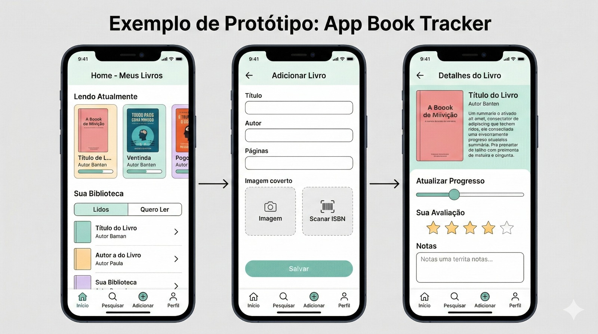

# 📚 App Book Tracker

Um aplicativo de *diário de leitura* inspirado no sistema do Letterboxd, criado para ajudar leitores a *registrar, avaliar e compartilhar suas experiências com livros* de forma simples e organizada.

## ✨ Sobre o projeto

O Reading Journal App permite que leitores acompanhem os livros que já leram e registrem suas impressões pessoais. A proposta é criar uma experiência semelhante a um *diário de leitura digital*, onde cada livro pode receber uma avaliação rápida, um comentário curto e recomendações de leituras semelhantes.

O objetivo do projeto é incentivar o hábito da leitura e facilitar o acompanhamento do histórico de livros lidos.

## 🚀 Funcionalidades

* 📖 *Registro de livros lidos*
  Adicione livros que você terminou de ler ao seu diário.

* ⭐ *Sistema de avaliação*
  Avalie cada livro usando uma escala de *1 a 5 estrelas*.

* ✍️ *Comentário curto*
  Escreva uma breve descrição da sua avaliação com até *200 caracteres*.

* 🗂️ *Histórico de leitura*
  Visualize todos os livros que você já registrou no aplicativo.

## 🎯 Objetivo

Este projeto foi desenvolvido como uma forma de:

* Organizar leituras pessoais
* Compartilhar impressões rápidas sobre livros
* Criar um histórico de leitura acessível
* Facilitar a descoberta de novas leituras através de recomendações

## 🛠️ Possíveis melhorias futuras

* Recomendações de livros semelhantes
* Sistema de perfis de usuários
* Lista de livros "quero ler"
* Feed social de avaliações
* Curtidas e comentários em reviews
* Integração com APIs de livros (ex: Open Library ou Google Books)

## 📌 Estrutura básica de um registro

Cada entrada no diário contém:

* *Livro*
* *Avaliação:* 1 ⭐ a 5 ⭐
* *Comentário:* até 200 caracteres
* *4 recomendações de livros semelhantes*

## 🛠️ Tecnologias Utilizadas

Este projeto foi desenvolvido utilizando as seguintes tecnologias:

- **Frontend:** Kotlin
- **Backend:** C#
- **API:** C#
- **Banco de dados:** MongoDB
- **Controle de versão:** Git e GitHub
- **Gerenciador de pacotes:** Gradle
  
## 🤝 Contribuição

Contribuições são bem-vindas!

Se você quiser colaborar com melhorias, novas funcionalidades ou correções:

1. Faça um fork do projeto
2. Crie uma branch para sua feature
3. Faça commit das mudanças
4. Abra um Pull Request

## 📄 Licença

Este projeto está sob a licença MIT. Sinta-se livre para usar, modificar e distribuir.

---

💡 Projeto criado para incentivar o hábito da leitura e o compartilhamento de experiências literárias.
