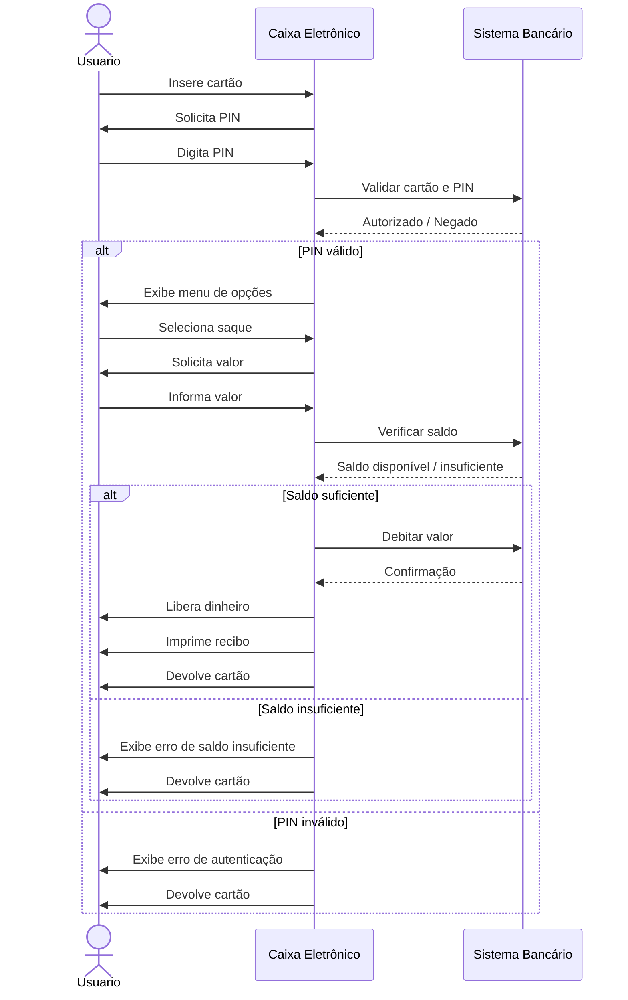

```mermaid
sequenceDiagram
    actor Usuario
    participant Caixa as Caixa Eletrônico
    participant Banco as Sistema Bancário

    Usuario->>Caixa: Insere cartão
    Caixa->>Usuario: Solicita PIN
    Usuario->>Caixa: Digita PIN

    Caixa->>Banco: Validar cartão e PIN
    Banco-->>Caixa: Autorizado / Negado

    alt PIN válido
        Caixa->>Usuario: Exibe menu de opções
        Usuario->>Caixa: Seleciona saque
        Caixa->>Usuario: Solicita valor
        Usuario->>Caixa: Informa valor

        Caixa->>Banco: Verificar saldo
        Banco-->>Caixa: Saldo disponível / insuficiente

        alt Saldo suficiente
            Caixa->>Banco: Debitar valor
            Banco-->>Caixa: Confirmação

            Caixa->>Usuario: Libera dinheiro
            Caixa->>Usuario: Imprime recibo
            Caixa->>Usuario: Devolve cartão
        else Saldo insuficiente
            Caixa->>Usuario: Exibe erro de saldo insuficiente
            Caixa->>Usuario: Devolve cartão
        end

    else PIN inválido
        Caixa->>Usuario: Exibe erro de autenticação
        Caixa->>Usuario: Devolve cartão
    end
```
