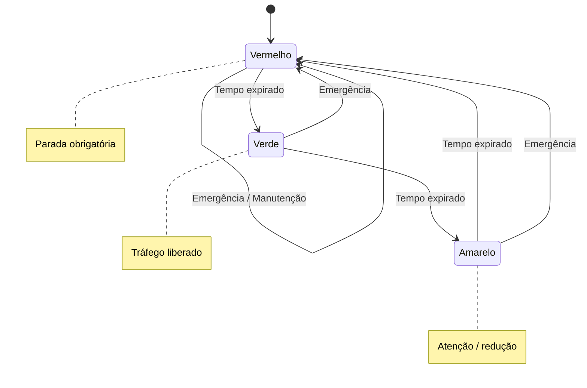

```mermaid
stateDiagram-v2
    [*] --> Vermelho

    Vermelho --> Verde: Tempo expirado
    Verde --> Amarelo: Tempo expirado
    Amarelo --> Vermelho: Tempo expirado

    Vermelho --> Vermelho: Emergência / Manutenção
    Verde --> Vermelho: Emergência
    Amarelo --> Vermelho: Emergência

    note right of Verde
        Tráfego liberado
    end note

    note right of Amarelo
        Atenção / redução
    end note

    note right of Vermelho
        Parada obrigatória
    end note
```
